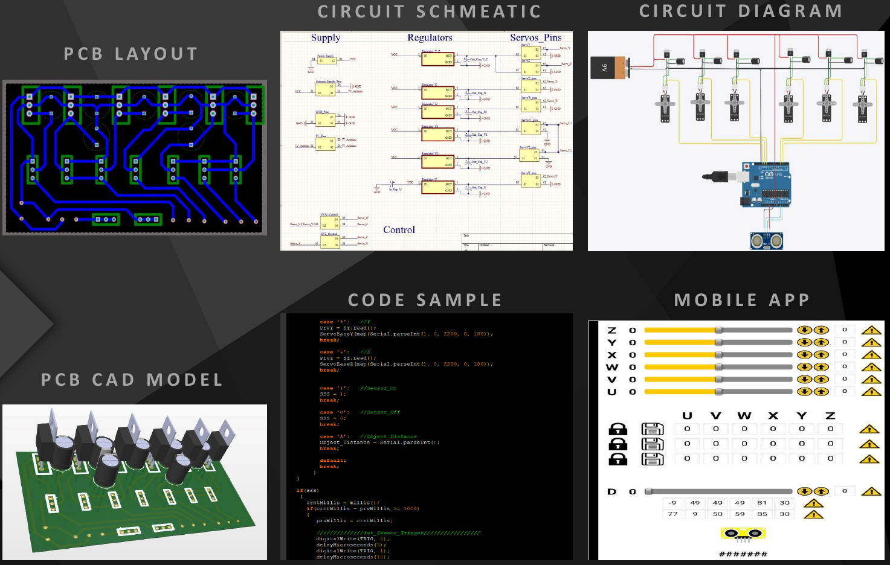

# Autonomous-Robotic-Arm

 
 
   

<!-- {{{Table of Contents --> 

 

## Table of Contents

* [Table of Contents](#table-of-contents)
* [Project DEMO](#project-demo)
* [Introduction](#introduction)
* [Project Design Phase](#project-design-phase)
  * [Electrical Design Phase](#-electrical-design-phase)
  * [Mechanical Design Phase](#-mechanical-design-phase)
* [Project Specifications](#project-specifications)

 
 

<!-- }}} -->

<!-- {{{Project DEMO --> 

## Project DEMO

* Link for Full Video with Explanation :   
    - drive.google.com/file/d/1RDlcdBdnj1vNe7r-o8fx5oqH77sbYkZg/view?usp=drivesdk

 

* Project Demo :  
   

<!-- }}} -->

<!-- {{{Introduction --> 
 

## Introduction

This Project is enthusiastically implemented by a group of Engineering students at Faculty of Engineering Ain Shams University.
 
 
Much research & planning was done before the project. Many Plans & ideas were considered. In addition to that, lots of potential problems were discussed.
 
 
Many problems where faced during the process of the design and implementation of the project. These problems were carefully tackled via innovative Engineering approaches.
 
 
This Project involves a lot of aspects. It mainly consists of two major sectors : 
* Electrical Design Sector 
    - Transducer/Circuit/PCB 
    - Programming/Automation 
 
* Mechanical Design Sector 
    - Statics (Supports/Weights) 
    - Dynamics (Motors/Degree of Freedom) 

 
<!-- }}} -->

<!-- {{{Project Design Phase --> 
## Project Design Phase

### >>>>>>>>> Electrical Design Phase
  

 

### >>>>>>>>> Mechanical Design Phase
  
 
<!-- }}} -->

<!-- {{{Project Specifications --> 

## Project Specifications 

* Languages : C/C++

* Design Approach : Functional Programming

* Tools used :
    - gcc (C/C++)
    - Altium Designer
    - TinkerCad Circuit Simulator
    - MIT App Inventor
    - SolidWorks Design
    - AutoDesk Systems

* Technical Specifications :
    - Operating Voltage : 9~12V
    - Battery Lifetime : 2~3 Hours (Average Load)
    - Ultrasonic Frequency : 40Khz ~ 250Khz
    - Maximum Lift Weight : 0.535Kg
    - Degree of Freedom : 6 DOFs
    - Rotation Degree/Servo : 180

* Components used :
    - Arduino UNO, Ultrasonic Sensor, HC-05 Module
    - Li-ion 18650 Batteries
    - PCB FR4, Thermal paper, FeCl3 conc. Acid
    - Jumper Wires, Male Pin Headers
    - LM7806CV, Capacitors
    - Plywood 3mm, Rigid Foam
    - Nuts & Screws, Caster Wheels
    - Adhesive Tape, Adhesive Glue

 
<!-- }}} -->

